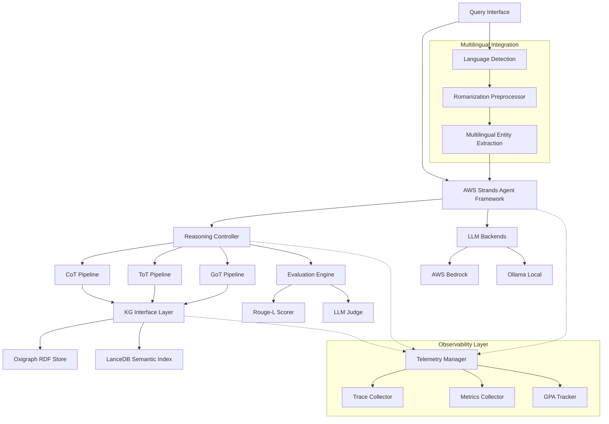

# Design Document

## Overview

The KG-grounded reasoning system is a modular, standalone framework that combines advanced reasoning strategies (CoT/ToT/GoT) with knowledge graph exploration. Built on proven technologies (Oxigraph, LanceDB, AWS Strands), it provides a robust foundation for grounded LLM reasoning with comprehensive evaluation capabilities.

## Architecture

### High-Level Components



### Core Architecture Principles

1. **Modular Design**: Each reasoning strategy (CoT/ToT/GoT) is implemented as a separate pipeline with shared KG interface
2. **Technology Integration**: Leverages existing project infrastructure (AWS Strands, Oxigraph, LanceDB)
3. **Multilingual Compatibility**: Seamlessly integrates with existing multilingual processing capabilities without modification
4. **Language Agnostic Core**: The reasoning engine works independently of language-specific preprocessing
5. **Consistent Observability**: Uses the same telemetry patterns as multilingual-kg-observability for unified monitoring
6. **Extensibility**: Clear interfaces for adding new reasoning strategies or KG backends
7. **Performance**: Optimized for real-time queries with caching and batch processing

## Multilingual Integration Strategy

### Language-Agnostic Design

The KG reasoning system is designed to be **completely independent** of multilingual capabilities while seamlessly integrating with them:

```python
class MultilingualKGReasoningAgent:
    """Language-agnostic reasoning agent that integrates with multilingual preprocessing"""
    
    def __init__(self, config: AgentConfig):
        # Core reasoning components (language-independent)
        self.reasoning_controller = ReasoningController(config)
        self.kg_interface = KGInterface(config)
        
        # Optional multilingual integration
        self.multilingual_processor = None
        if config.enable_multilingual:
            self.multilingual_processor = MultilingualProcessor(config)
    
    async def process_query(self, question: str, language: str = None) -> ReasoningResult:
        """Process query with optional multilingual preprocessing"""
        
        # Optional multilingual preprocessing
        processed_question = question
        if self.multilingual_processor and language:
            processed_question = await self.multilingual_processor.preprocess(
                question, language
            )
        
        # Language-agnostic reasoning (core functionality)
        result = await self.reasoning_controller.reason(
            processed_question, 
            strategy=self.config.reasoning_strategy
        )
        
        # Optional multilingual postprocessing
        if self.multilingual_processor and language:
            result = await self.multilingual_processor.postprocess(result, language)
            
        return result
```

### Integration Points

1. **Input Processing**: Optional multilingual preprocessing (romanization, language detection)
2. **Entity Extraction**: Multilingual entity recognition feeds into language-agnostic KG queries
3. **Output Generation**: Optional multilingual response formatting
4. **KG Content**: The reasoning system works with any RDF content, regardless of language

### Compatibility Guarantee

- **Zero Dependencies**: Core reasoning works without any multilingual components
- **Plug-and-Play**: Multilingual features can be enabled/disabled via configuration
- **Shared Infrastructure**: Uses same Oxigraph, LanceDB, and AWS Strands components
- **Unified Observability**: Same telemetry patterns across both systems

## Observability Integration

### Consistent Telemetry Patterns

The observability implementation follows **exactly the same patterns** as `multilingual-kg-observability`:

```python
class KGReasoningTelemetryManager(MultilingualKGTelemetryManager):
    """Extends multilingual telemetry for reasoning-specific metrics"""
    
    def __init__(self, config: TelemetryConfig):
        super().__init__(config)
        self.reasoning_metrics = self._setup_reasoning_metrics()
    
    def _setup_reasoning_metrics(self):
        """Add reasoning-specific metrics to existing multilingual metrics"""
        return {
            "reasoning_steps": self.get_meter("kg_reasoning").create_counter(
                "reasoning_steps_total",
                description="Total reasoning steps executed"
            ),
            "reasoning_latency": self.get_meter("kg_reasoning").create_histogram(
                "reasoning_latency_ms",
                description="Reasoning pipeline latency"
            ),
            "kg_queries": self.get_meter("kg_reasoning").create_counter(
                "kg_queries_total", 
                description="Knowledge graph queries executed"
            )
        }
```

### Shared Observability Components

1. **Same Telemetry Manager**: Reuses `MultilingualKGTelemetryManager`
2. **Same Export Destinations**: AWS X-Ray, CloudWatch, Jaeger, Snowflake
3. **Same Trace Attributes**: Extends existing attribute schema
4. **Same GPA Tracking**: Adds reasoning metrics to existing analytics

### Extended Trace Attributes

```python
class ReasoningTraceAttributes(TraceAttributes):
    """Extends multilingual trace attributes for reasoning operations"""
    
    # Reasoning-specific attributes
    REASONING_STRATEGY = "kg.reasoning.strategy"  # cot, tot, got
    REASONING_STEPS = "kg.reasoning.steps"
    REASONING_DEPTH = "kg.reasoning.depth"
    KG_QUERIES_COUNT = "kg.reasoning.kg_queries"
    THOUGHT_BRANCHES = "kg.reasoning.branches"  # for ToT/GoT
    MERGE_OPERATIONS = "kg.reasoning.merges"    # for GoT
    
    # Quality attributes
    REASONING_CONFIDENCE = "kg.reasoning.confidence"
    ANSWER_QUALITY_SCORE = "kg.reasoning.answer_quality"
    KG_GROUNDING_RATIO = "kg.reasoning.grounding_ratio"
```

## Components and Interfaces

### 1. AWS Strands Agent Framework Integration

```python
class KGReasoningAgent:
    """Main agent class using AWS Strands framework"""
    
    def __init__(self, config: AgentConfig):
        self.llm_backend = self._setup_llm_backend(config)
        self.kg_interface = KGInterface(config)
        self.reasoning_controller = ReasoningController(config)
        
    async def process_query(self, question: str, strategy: str) -> ReasoningResult:
        """Process a question using specified reasoning strategy"""
        pass
```

**Key Features:**
- Seamless integration with existing AWS Strands patterns
- Support for both AWS Bedrock and Ollama backends
- Async processing for improved performance
- Built-in retry logic and error handling

### 2. Knowledge Graph Interface Layer

```python
class KGInterface:
    """Unified interface for KG operations"""
    
    def __init__(self, config: KGConfig):
        self.graph_store = OxigraphStore(config.oxigraph_path)
        self.semantic_index = LanceDBIndex(config.lancedb_path)
        self.entity_cache = EntityCache(config.cache_size)
        
    async def retrieve_nodes(self, query: str, top_k: int = 5) -> List[Node]:
        """Semantic search for relevant nodes"""
        pass
        
    async def get_neighbors(self, node_id: str, relation_type: str = None) -> List[Node]:
        """Get neighboring nodes via SPARQL query"""
        pass
        
    async def get_node_features(self, node_id: str, feature_type: str = None) -> Dict:
        """Retrieve node attributes and properties"""
        pass
```

**Technology Integration:**
- **Oxigraph**: RDF triple store for efficient graph operations and SPARQL queries
- **LanceDB**: Vector database for semantic entity search and retrieval
- **Caching Layer**: In-memory cache for frequently accessed nodes and relationships

### 3. Reasoning Pipeline Controllers

#### Chain-of-Thought (CoT) Pipeline
```python
class CoTPipeline:
    """Sequential reasoning with KG grounding"""
    
    async def execute(self, question: str, max_steps: int = 10) -> ReasoningResult:
        scratchpad = []
        for step in range(max_steps):
            # Generate next thought
            thought = await self._generate_thought(question, scratchpad)
            
            # Extract entities and query KG
            entities = await self._extract_entities(thought)
            kg_evidence = await self._gather_evidence(entities)
            
            # Update scratchpad
            scratchpad.append({
                "step": step,
                "thought": thought,
                "entities": entities,
                "evidence": kg_evidence
            })
            
            # Check termination condition
            if await self._should_terminate(thought):
                break
                
        return await self._synthesize_answer(question, scratchpad)
```

#### Tree-of-Thought (ToT) Pipeline
```python
class ToTPipeline:
    """Branching reasoning with state evaluation"""
    
    async def execute(self, question: str, max_depth: int = 5, k: int = 3, t: int = 3) -> ReasoningResult:
        root_state = ReasoningState(thoughts=[], kg_evidence=[])
        frontier = [root_state]
        
        for depth in range(max_depth):
            candidates = []
            
            # Generate k candidates for each frontier state
            for state in frontier:
                for _ in range(k):
                    candidate = await self._generate_candidate(question, state)
                    kg_evidence = await self._gather_evidence_for_candidate(candidate)
                    candidates.append(candidate.with_evidence(kg_evidence))
            
            # Evaluate and select top t candidates
            scored_candidates = await self._evaluate_candidates(question, candidates)
            frontier = self._select_top_candidates(scored_candidates, t)
            
        # Select best final state and synthesize answer
        best_state = await self._select_best_final_state(frontier, question)
        return await self._synthesize_answer(question, best_state)
```

#### Graph-of-Thought (GoT) Pipeline
```python
class GoTPipeline:
    """Graph-based reasoning with thought merging"""
    
    async def execute(self, question: str, max_iterations: int = 10) -> ReasoningResult:
        thought_graph = ThoughtGraph()
        
        for iteration in range(max_iterations):
            # Generate new thoughts
            new_thoughts = await self._generate_thoughts(question, thought_graph)
            
            # Add to graph with KG evidence
            for thought in new_thoughts:
                kg_evidence = await self._gather_evidence(thought)
                thought_graph.add_node(thought, kg_evidence)
            
            # Identify merge opportunities
            merge_candidates = self._identify_merge_candidates(thought_graph)
            
            # Perform merges
            for candidate_pair in merge_candidates:
                merged_thought = await self._merge_thoughts(candidate_pair)
                thought_graph.merge_nodes(candidate_pair, merged_thought)
            
            # Check convergence
            if self._has_converged(thought_graph):
                break
                
        return await self._synthesize_from_graph(question, thought_graph)
```

### 4. Social Media Knowledge Graph Schema

```turtle
@prefix sm: <http://socialmedia.kg/> .
@prefix foaf: <http://xmlns.com/foaf/0.1/> .
@prefix dct: <http://purl.org/dc/terms/> .

# User entities
sm:User a rdfs:Class ;
    rdfs:label "Social Media User" .

# Post entities  
sm:Post a rdfs:Class ;
    rdfs:label "Social Media Post" .

# Topic/Hashtag entities
sm:Topic a rdfs:Class ;
    rdfs:label "Topic or Hashtag" .

# Relationships
sm:follows a rdf:Property ;
    rdfs:domain sm:User ;
    rdfs:range sm:User .

sm:likes a rdf:Property ;
    rdfs:domain sm:User ;
    rdfs:range sm:Post .

sm:shares a rdf:Property ;
    rdfs:domain sm:User ;
    rdfs:range sm:Post .

sm:mentions a rdf:Property ;
    rdfs:domain sm:Post ;
    rdfs:range sm:User .

sm:hasTag a rdf:Property ;
    rdfs:domain sm:Post ;
    rdfs:range sm:Topic .
```

**Synthetic Data Generation:**
- 1000+ user profiles with demographics, interests, and activity patterns
- 10,000+ posts with content, timestamps, engagement metrics
- Rich relationship network modeling influence and information flow
- Topic categorization for content analysis and trend detection

## Data Models

### Core Data Structures

```python
@dataclass
class ReasoningState:
    """Represents a state in the reasoning process"""
    thoughts: List[str]
    kg_evidence: List[Triple]
    entities: Set[str]
    confidence: float
    step_count: int

@dataclass
class Triple:
    """RDF triple from knowledge graph"""
    subject: str
    predicate: str
    object: str
    confidence: float = 1.0

@dataclass
class ReasoningResult:
    """Final result of reasoning process"""
    answer: str
    reasoning_chain: List[ReasoningState]
    kg_queries_used: List[str]
    total_steps: int
    confidence: float
    evaluation_metrics: Dict[str, float]

@dataclass
class Node:
    """Knowledge graph node representation"""
    id: str
    type: str
    properties: Dict[str, Any]
    embedding: Optional[np.ndarray] = None
```

### Configuration Models

```python
@dataclass
class KGConfig:
    """Knowledge graph configuration"""
    oxigraph_path: str
    lancedb_path: str
    cache_size: int = 10000
    embedding_model: str = "sentence-transformers/all-mpnet-base-v2"
    
@dataclass
class ReasoningConfig:
    """Reasoning strategy configuration"""
    strategy: str  # "cot", "tot", "got"
    max_steps: int = 10
    max_depth: int = 5  # for ToT/GoT
    branching_factor: int = 3  # for ToT/GoT
    selection_count: int = 3  # for ToT/GoT
    temperature: float = 0.7
    
@dataclass
class AgentConfig:
    """AWS Strands agent configuration"""
    llm_backend: str  # "bedrock" or "ollama"
    model_name: str
    aws_region: str = "us-east-1"
    ollama_endpoint: str = "http://localhost:11434"
```

## Error Handling

### Robust Parsing and Fallbacks

```python
class OutputParser:
    """Handles LLM output parsing with fallbacks"""
    
    def parse_structured_output(self, text: str) -> Dict:
        """Parse JSON with multiple fallback strategies"""
        try:
            return json.loads(text)
        except json.JSONDecodeError:
            # Try regex extraction
            return self._regex_fallback(text)
        except Exception:
            # Return default structure
            return self._default_structure()
    
    def _regex_fallback(self, text: str) -> Dict:
        """Extract structured data using regex patterns"""
        patterns = {
            "thought": r"THOUGHT:\s*(.+?)(?=ACTION:|$)",
            "action": r"ACTION:\s*(\w+)",
            "arg": r"ARG:\s*(.+?)(?=\n|$)"
        }
        return {key: re.search(pattern, text, re.DOTALL).group(1).strip() 
                for key, pattern in patterns.items() 
                if re.search(pattern, text, re.DOTALL)}
```

### Retry Logic and Circuit Breakers

```python
class ResilientLLMClient:
    """LLM client with retry logic and circuit breaker"""
    
    def __init__(self, max_retries: int = 3, backoff_factor: float = 2.0):
        self.max_retries = max_retries
        self.backoff_factor = backoff_factor
        self.circuit_breaker = CircuitBreaker()
    
    async def generate(self, prompt: str, **kwargs) -> str:
        """Generate with exponential backoff retry"""
        for attempt in range(self.max_retries):
            try:
                return await self.circuit_breaker.call(
                    self._raw_generate, prompt, **kwargs
                )
            except Exception as e:
                if attempt == self.max_retries - 1:
                    raise
                await asyncio.sleep(self.backoff_factor ** attempt)
```

## Testing Strategy

### Core Testing Principle: NO MOCKS - Real Components Only

All tests MUST use real components:
- Real AWS Strands agents (Bedrock/Ollama)
- Real sentence-transformer models for embeddings
- Real Oxigraph RDF store for graph operations
- Real LanceDB vector database for semantic search
- NO mock agents, NO mock KG interfaces, NO mock LLM responses

### Test File Organization

**CRITICAL**: All test files MUST be placed in `docker_app/backend/` directory with proper imports:

```python
# Correct import pattern
from kg_reasoning.core.reasoning_agent import KGReasoningAgent
from kg_reasoning.config.agent_config import AgentConfig
```

See `docker_app/backend/TESTING_GUIDELINES.md` for complete testing standards.

### Unit Tests (with Real Components)
- **KG Interface Tests**: Verify Oxigraph and LanceDB operations with real stores
- **Pipeline Tests**: Test each reasoning strategy with real AWS Strands agents
- **Parser Tests**: Validate robust output parsing with real LLM responses
- **Agent Integration Tests**: Test AWS Strands framework with actual Bedrock/Ollama

### Integration Tests
- **End-to-End Reasoning**: Complete question-answering workflows with real LLM calls
- **Multi-Strategy Comparison**: Verify consistent interfaces across CoT/ToT/GoT with real execution
- **Performance Tests**: Latency and throughput under load with real components
- **Error Recovery Tests**: System behavior under various failure conditions with real services

### Evaluation Framework
```python
class EvaluationSuite:
    """Comprehensive evaluation of reasoning quality"""
    
    async def evaluate_answer_quality(self, 
                                    question: str, 
                                    generated_answer: str, 
                                    ground_truth: str) -> Dict[str, float]:
        """Multi-metric evaluation"""
        return {
            "rouge_l": self._compute_rouge_l(generated_answer, ground_truth),
            "llm_judge_score": await self._llm_judge_evaluation(question, generated_answer, ground_truth),
            "semantic_similarity": self._compute_semantic_similarity(generated_answer, ground_truth),
            "factual_accuracy": await self._verify_factual_accuracy(generated_answer)
        }
    
    def evaluate_reasoning_process(self, reasoning_result: ReasoningResult) -> Dict[str, float]:
        """Evaluate reasoning process quality"""
        return {
            "step_efficiency": len(reasoning_result.reasoning_chain) / reasoning_result.total_steps,
            "kg_utilization": len(reasoning_result.kg_queries_used) / reasoning_result.total_steps,
            "confidence_calibration": self._compute_confidence_calibration(reasoning_result),
            "reasoning_coherence": self._assess_reasoning_coherence(reasoning_result.reasoning_chain)
        }
```

### Social Media Test Scenarios
- **Influence Analysis**: "Who are the most influential users in the climate change discussion?"
- **Content Propagation**: "How did this viral post spread through the network?"
- **Community Detection**: "What are the main communities discussing cryptocurrency?"
- **Trend Analysis**: "What topics are trending among users aged 18-25?"
- **Misinformation Tracking**: "How does false information spread compared to verified news?"

## Performance Optimizations

### Caching Strategy
```python
class MultiLevelCache:
    """Hierarchical caching for KG operations"""
    
    def __init__(self):
        self.l1_cache = LRUCache(maxsize=1000)  # Hot entities
        self.l2_cache = LRUCache(maxsize=10000)  # Warm entities
        self.embedding_cache = LRUCache(maxsize=5000)  # Computed embeddings
    
    async def get_node(self, node_id: str) -> Optional[Node]:
        """Multi-level cache lookup"""
        # Check L1 cache first
        if node := self.l1_cache.get(node_id):
            return node
            
        # Check L2 cache
        if node := self.l2_cache.get(node_id):
            self.l1_cache[node_id] = node  # Promote to L1
            return node
            
        # Fetch from storage
        node = await self._fetch_from_storage(node_id)
        if node:
            self.l2_cache[node_id] = node
        return node
```

### Batch Processing
```python
class BatchProcessor:
    """Efficient batch processing for multiple queries"""
    
    async def process_batch(self, questions: List[str], strategy: str) -> List[ReasoningResult]:
        """Process multiple questions with shared KG context"""
        # Pre-load relevant KG subgraph
        all_entities = set()
        for question in questions:
            entities = await self._extract_entities(question)
            all_entities.update(entities)
        
        # Batch load KG context
        kg_context = await self._batch_load_kg_context(all_entities)
        
        # Process questions with shared context
        tasks = [self._process_with_context(q, strategy, kg_context) for q in questions]
        return await asyncio.gather(*tasks)
```

## Observability Implementation Details

### Instrumentation Wrapper for Reasoning

```python
class ReasoningInstrumentationWrapper(KGInstrumentationWrapper):
    """Extends multilingual instrumentation for reasoning operations"""
    
    def trace_reasoning_pipeline(self, strategy: str, question: str):
        """Trace complete reasoning pipeline execution"""
        return self.tracer.start_span(
            f"reasoning.{strategy}",
            attributes={
                ReasoningTraceAttributes.REASONING_STRATEGY: strategy,
                ReasoningTraceAttributes.CONTENT_LENGTH: len(question)
            }
        )
    
    def measure_reasoning_step(self, step_number: int, thought: str):
        """Measure individual reasoning step performance"""
        return self.tracer.start_span(
            "reasoning.step",
            attributes={
                ReasoningTraceAttributes.REASONING_STEPS: step_number,
                "reasoning.thought.length": len(thought)
            }
        )
    
    def track_kg_query(self, query_type: str, entity_count: int):
        """Track knowledge graph query operations"""
        self.reasoning_metrics["kg_queries"].add(1, {
            "query_type": query_type,
            "entity_count": entity_count
        })
```

### GPA Tracker Extension

```python
class ReasoningGPATracker(MultilingualGPATracker):
    """Extends multilingual GPA tracking for reasoning analytics"""
    
    def track_reasoning_performance(self, 
                                  strategy: str, 
                                  metrics: ReasoningMetrics):
        """Track reasoning strategy performance"""
        self.record_performance_metric(
            component="reasoning",
            strategy=strategy,
            metrics={
                "steps_efficiency": metrics.steps / metrics.max_steps,
                "kg_utilization": metrics.kg_queries / metrics.steps,
                "answer_quality": metrics.answer_quality_score,
                "confidence": metrics.confidence
            }
        )
    
    def analyze_reasoning_patterns(self, 
                                 time_range: TimeRange) -> ReasoningAnalytics:
        """Analyze reasoning patterns across strategies"""
        return ReasoningAnalytics(
            strategy_performance=self._compare_strategies(time_range),
            kg_usage_patterns=self._analyze_kg_usage(time_range),
            quality_trends=self._analyze_quality_trends(time_range),
            efficiency_metrics=self._calculate_efficiency_metrics(time_range)
        )
```

### Dashboard Integration

The system will extend existing CloudWatch and Grafana dashboards with reasoning-specific panels:

1. **Reasoning Performance Dashboard**: Strategy comparison, step efficiency, quality metrics
2. **KG Utilization Dashboard**: Query patterns, entity coverage, grounding effectiveness  
3. **Quality Analytics Dashboard**: Answer quality trends, confidence calibration, error analysis
4. **Cost Optimization Dashboard**: Token usage, API costs, sampling effectiveness

### Deployment Consistency

The deployment follows the same patterns as multilingual-kg-observability:

```python
# Lambda deployment with reasoning telemetry
reasoning_lambda_config = TelemetryConfig(
    export_mode=ExportMode.AWS,
    service_name="kg-reasoning-service",
    sample_rate=0.01,  # Same sampling as multilingual system
    enable_head_based_sampling=True,
    performance_monitoring=True,
    log_level="INFO"
)
```

This design provides a comprehensive, production-ready system that:

1. **Maintains Complete Independence**: Core reasoning works without multilingual dependencies
2. **Enables Seamless Integration**: Multilingual features plug in without code changes
3. **Ensures Observability Consistency**: Uses identical telemetry patterns and infrastructure
4. **Leverages Existing Infrastructure**: Builds on proven AWS Strands, Oxigraph, and LanceDB foundation
5. **Provides Unified Monitoring**: Single observability stack for both multilingual and reasoning capabilities

The modular architecture ensures easy integration with your existing systems while providing state-of-the-art reasoning capabilities.