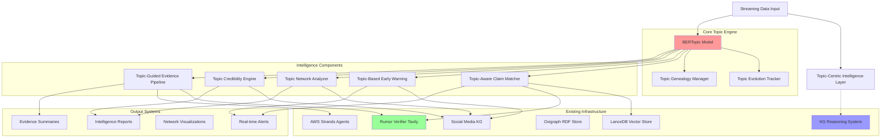
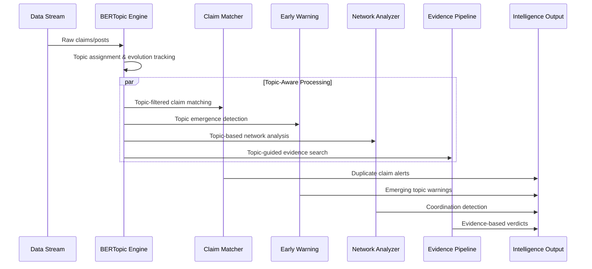

# Design Document

## Overview

The Misinformation Intelligence Layer extends the existing KG-grounded reasoning system with operational intelligence capabilities centered around topic modeling. Built on the foundation of the existing rumor_verifier_tavily script and BERTopic integration, this system transforms analytical capabilities into a complete disinformation intelligence platform that can detect, track, and respond to misinformation campaigns in real-time.

The design follows a **topic-centric architecture** where BERTopic serves as the central organizing component, enabling efficient pre-filtering, contextual understanding, and unified analysis across all intelligence functions.

## Architecture

### High-Level Topic-Centric Architecture



### Topic-Centric Processing Flow



## Components and Interfaces

### 1. Core Topic Engine

#### BERTopic Integration Manager
```python
class TopicIntelligenceEngine:
    """Central topic modeling component that orchestrates all intelligence functions"""
    
    def __init__(self, config: TopicConfig):
        # Reuse existing BERTopic infrastructure
        self.topic_model = BERTopic()
        self.topic_evolution_tracker = TopicEvolutionTracker()
        self.topic_genealogy = TopicGenealogyManager()
        
        # Integration with existing systems
        self.kg_interface = KGInterface(config.kg_config)  # Existing KG system
        self.lancedb = LanceDBIndex(config.lancedb_config)  # Existing vector store
        
    async def process_content(self, content: str, metadata: Dict) -> TopicIntelligence:
        """Main processing pipeline for all content"""
        # Topic assignment with confidence
        topic_info = await self.assign_topic(content)
        
        # Track topic evolution
        evolution_data = await self.track_evolution(topic_info, metadata)
        
        # Generate intelligence context
        intelligence = TopicIntelligence(
            topic_id=topic_info.topic_id,
            topic_confidence=topic_info.confidence,
            evolution_stage=evolution_data.stage,
            risk_indicators=evolution_data.risk_indicators
        )
        
        return intelligence
```

#### Topic Evolution Tracker
```python
class TopicEvolutionTracker:
    """Tracks how topics change and evolve over time"""
    
    def __init__(self):
        self.topic_history = {}
        self.evolution_patterns = {}
        
    async def track_evolution(self, topic_info: TopicInfo, timestamp: datetime) -> EvolutionData:
        """Track topic changes and predict evolution"""
        # Detect topic drift and mutation
        if topic_info.topic_id in self.topic_history:
            drift_score = self.calculate_drift(topic_info)
            if drift_score > 0.3:  # Significant evolution detected
                await self.record_evolution_event(topic_info, drift_score)
        
        # Predict next evolution based on patterns
        predicted_evolution = self.predict_evolution(topic_info)
        
        return EvolutionData(
            drift_score=drift_score,
            evolution_stage=self.get_lifecycle_stage(topic_info),
            predicted_mutations=predicted_evolution
        )
```

### 2. Topic-Aware Claim Matcher (Extends rumor_verifier_tavily)

```python
class TopicAwareClaimMatcher(RumorVerifierBatchLLM):
    """Extends existing rumor_verifier_tavily with topic-based matching"""
    
    def __init__(self, ttl_path: str, topic_engine: TopicIntelligenceEngine):
        super().__init__(ttl_path)
        self.topic_engine = topic_engine
        self.topic_claim_index = {}  # Topic-organized claim index
        
    async def match_claims_with_topics(self, new_claim: str) -> ClaimMatchResult:
        """Multi-level topic-aware claim matching"""
        
        # Step 1: Get topic assignment
        topic_intel = await self.topic_engine.process_content(new_claim, {})
        
        # Step 2: Topic-filtered search (fast pre-filtering)
        topic_candidates = self.get_claims_in_topic(topic_intel.topic_id)
        
        # Step 3: Semantic similarity within topic (precise matching)
        if topic_candidates:
            semantic_matches = await self.lancedb.search(
                new_claim,
                filter={"topic_id": topic_intel.topic_id},
                top_k=10
            )
        
        # Step 4: Cross-topic evolution matching (detect mutations)
        evolution_matches = await self.find_evolved_claims(new_claim, topic_intel)
        
        # Step 5: Reuse existing text cleaning from rumor_verifier_tavily
        cleaned_claim = _clean_claim_text(new_claim)
        
        return ClaimMatchResult(
            exact_matches=self.find_exact_matches(cleaned_claim),
            topic_matches=semantic_matches,
            evolution_matches=evolution_matches,
            confidence=self.calculate_match_confidence(semantic_matches, evolution_matches)
        )
    
    def _enhanced_tavily_search(self, cluster_claims: List[Tuple[str, str]]) -> str:
        """Enhanced version of existing _tavily_search with topic context"""
        
        # Get topic context for the cluster
        cluster_topics = [
            self.topic_engine.assign_topic(claim[1]) 
            for claim in cluster_claims
        ]
        
        # Use topic keywords for more targeted search
        topic_keywords = self.extract_topic_keywords(cluster_topics)
        
        # Reuse existing Tavily search logic with topic enhancement
        return super()._tavily_search(cluster_claims) + f" {topic_keywords}"
```

### 3. Topic-Based Early Warning System

```python
class TopicBasedEarlyWarning:
    """Detects emerging misinformation topics and coordinated campaigns"""
    
    def __init__(self, topic_engine: TopicIntelligenceEngine):
        self.topic_engine = topic_engine
        self.velocity_tracker = TopicVelocityTracker()
        self.coordination_detector = CoordinationDetector()
        
    async def monitor_topic_emergence(self) -> List[EarlyWarningAlert]:
        """Monitor for new topics and rapid growth patterns"""
        alerts = []
        
        # Detect new topic emergence
        new_topics = await self.detect_new_topics(time_window="6h")
        
        for topic in new_topics:
            # Calculate risk indicators
            velocity = self.velocity_tracker.calculate_velocity(topic)
            coordination = self.coordination_detector.analyze_posting_patterns(topic)
            
            if velocity.growth_rate > 5.0 and coordination.synchronization_score > 0.8:
                alert = EarlyWarningAlert(
                    topic_id=topic.id,
                    alert_type="COORDINATED_EMERGENCE",
                    risk_level="HIGH",
                    velocity_metrics=velocity,
                    coordination_indicators=coordination,
                    predicted_reach=self.predict_viral_potential(topic)
                )
                alerts.append(alert)
        
        return alerts
    
    async def detect_coordinated_campaigns(self) -> List[CoordinationAlert]:
        """Detect coordinated posting patterns across topics"""
        # Analyze posting synchronization
        suspicious_patterns = self.coordination_detector.find_suspicious_patterns()
        
        alerts = []
        for pattern in suspicious_patterns:
            if pattern.accounts_count > 50 and pattern.time_window < timedelta(hours=2):
                alert = CoordinationAlert(
                    pattern_id=pattern.id,
                    topic_ids=pattern.topics,
                    coordinated_accounts=pattern.accounts,
                    synchronization_score=pattern.sync_score,
                    estimated_reach=pattern.potential_reach
                )
                alerts.append(alert)
        
        return alerts
```

### 4. Topic Network Analyzer

```python
class TopicNetworkAnalyzer:
    """Analyzes social networks through topic lens"""
    
    def __init__(self, topic_engine: TopicIntelligenceEngine, social_kg: SocialMediaKG):
        self.topic_engine = topic_engine
        self.social_kg = social_kg
        self.network_graph = NetworkGraph()
        
    async def analyze_topic_communities(self, topic_id: str) -> TopicCommunityAnalysis:
        """Analyze communities around specific topics"""
        
        # Get users posting about this topic
        topic_users = await self.social_kg.get_users_by_topic(topic_id)
        
        # Build topic-specific network
        topic_network = self.build_topic_network(topic_users, topic_id)
        
        # Detect communities and echo chambers
        communities = self.detect_communities(topic_network)
        echo_chambers = self.identify_echo_chambers(communities)
        
        # Find bridge users (cross-topic influencers)
        bridge_users = self.find_cross_topic_bridges(topic_id)
        
        return TopicCommunityAnalysis(
            topic_id=topic_id,
            communities=communities,
            echo_chambers=echo_chambers,
            bridge_influencers=bridge_users,
            polarization_score=self.calculate_polarization(communities)
        )
    
    async def track_topic_propagation(self, topic_id: str) -> PropagationAnalysis:
        """Track how topics spread through networks"""
        
        # Get topic timeline
        topic_timeline = await self.get_topic_timeline(topic_id)
        
        # Analyze propagation paths
        propagation_paths = self.trace_propagation_paths(topic_timeline)
        
        # Identify super-spreaders
        super_spreaders = self.identify_super_spreaders(propagation_paths)
        
        return PropagationAnalysis(
            topic_id=topic_id,
            propagation_velocity=self.calculate_propagation_velocity(propagation_paths),
            key_amplifiers=super_spreaders,
            bottlenecks=self.identify_bottlenecks(propagation_paths),
            cross_platform_spread=self.analyze_cross_platform_spread(topic_id)
        )
```

### 5. Topic-Specific Credibility Engine

```python
class TopicCredibilityEngine:
    """Calculates topic-specific credibility scores"""
    
    def __init__(self, topic_engine: TopicIntelligenceEngine, social_kg: SocialMediaKG):
        self.topic_engine = topic_engine
        self.social_kg = social_kg
        self.credibility_history = {}
        
    async def calculate_topic_credibility(self, user_id: str, topic_id: str) -> TopicCredibilityScore:
        """Calculate user credibility for specific topic"""
        
        # Get user's history in this topic
        topic_history = await self.social_kg.get_user_topic_history(user_id, topic_id)
        
        # Calculate accuracy metrics
        accuracy_score = self.calculate_topic_accuracy(user_id, topic_id, topic_history)
        
        # Analyze network position within topic community
        network_authority = await self.calculate_topic_authority(user_id, topic_id)
        
        # Check for coordination indicators
        coordination_flags = self.detect_coordination_indicators(user_id, topic_id)
        
        credibility = TopicCredibilityScore(
            user_id=user_id,
            topic_id=topic_id,
            accuracy_score=accuracy_score,
            authority_score=network_authority,
            coordination_risk=coordination_flags.risk_level,
            expertise_indicators=self.assess_topic_expertise(user_id, topic_id),
            historical_performance=self.get_historical_credibility(user_id, topic_id)
        )
        
        return credibility
    
    async def identify_topic_authorities(self, topic_id: str) -> List[TopicAuthority]:
        """Identify genuine vs fake authorities for a topic"""
        
        topic_participants = await self.social_kg.get_topic_participants(topic_id)
        
        authorities = []
        for user in topic_participants:
            credibility = await self.calculate_topic_credibility(user.id, topic_id)
            
            # Real authorities: high accuracy, cited by credible sources, consistent over time
            if (credibility.accuracy_score > 0.8 and 
                credibility.authority_score > 0.7 and 
                credibility.coordination_risk < 0.3):
                
                authority = TopicAuthority(
                    user_id=user.id,
                    topic_id=topic_id,
                    authority_type="GENUINE_EXPERT",
                    credibility_score=credibility,
                    citation_network=await self.get_citation_network(user.id, topic_id)
                )
                authorities.append(authority)
        
        return authorities
```

### 6. Topic-Guided Evidence Pipeline (Extends rumor_verifier_tavily)

```python
class TopicGuidedEvidenceRetriever(RumorVerifierBatchLLM):
    """Enhanced evidence retrieval using topic context"""
    
    def __init__(self, ttl_path: str, topic_engine: TopicIntelligenceEngine):
        super().__init__(ttl_path)
        self.topic_engine = topic_engine
        
    async def gather_topic_evidence(self, claim: str, topic_context: TopicIntelligence) -> EvidencePackage:
        """Gather evidence using topic-guided search"""
        
        # Generate topic-specific search queries
        topic_keywords = self.topic_engine.get_topic_keywords(topic_context.topic_id)
        search_queries = self.generate_topic_queries(claim, topic_keywords)
        
        evidence_sources = []
        for query in search_queries:
            # Use enhanced Tavily search with topic context
            evidence = await self.enhanced_tavily_search_with_topic(query, topic_context)
            evidence_sources.extend(evidence)
        
        # Find counter-evidence for balanced analysis
        counter_evidence = await self.find_counter_evidence(claim, topic_context)
        
        # Assess evidence quality using topic-specific criteria
        quality_scores = self.assess_evidence_quality(evidence_sources, topic_context)
        
        return EvidencePackage(
            claim=claim,
            topic_context=topic_context,
            supporting_evidence=evidence_sources,
            counter_evidence=counter_evidence,
            quality_assessment=quality_scores,
            evidence_provenance=self.track_evidence_provenance(evidence_sources)
        )
    
    async def enhanced_tavily_search_with_topic(self, query: str, topic_context: TopicIntelligence) -> List[Evidence]:
        """Enhanced Tavily search using topic context"""
        
        # Build topic-aware search query
        topic_enhanced_query = f"{query} {' '.join(topic_context.keywords)}"
        
        # Use existing Tavily infrastructure with enhancements
        payload = {
            "query": topic_enhanced_query,
            "search_depth": "advanced",
            "max_results": 25,  # More results for topic-specific search
            "include_domains": self.get_trusted_domains_for_topic(topic_context.topic_id),
            "exclude_domains": self.get_unreliable_domains_for_topic(topic_context.topic_id)
        }
        
        # Reuse existing Tavily call logic
        response = await self.tavily_post(payload)
        
        # Process results with topic context
        evidence_items = []
        for result in response.get("results", []):
            evidence = Evidence(
                content=result.get("content", ""),
                source_url=result.get("url", ""),
                source_credibility=await self.assess_source_credibility(result.get("url", "")),
                topic_relevance=self.calculate_topic_relevance(result, topic_context),
                timestamp=result.get("published_date")
            )
            evidence_items.append(evidence)
        
        return evidence_items
```

## Data Models

### Core Topic Intelligence Models

```python
@dataclass
class TopicIntelligence:
    """Core topic intelligence context"""
    topic_id: str
    topic_confidence: float
    keywords: List[str]
    evolution_stage: str  # "emerging", "growing", "peak", "declining"
    risk_indicators: Dict[str, float]
    related_topics: List[str]
    temporal_patterns: Dict[str, Any]

@dataclass
class TopicEvolutionEvent:
    """Represents topic evolution/mutation"""
    original_topic_id: str
    evolved_topic_id: str
    evolution_type: str  # "drift", "split", "merge", "mutation"
    confidence: float
    timestamp: datetime
    trigger_events: List[str]

@dataclass
class ClaimMatchResult:
    """Enhanced claim matching with topic context"""
    exact_matches: List[ClaimMatch]
    topic_matches: List[ClaimMatch]
    evolution_matches: List[ClaimMatch]  # Claims from evolved topics
    cross_language_matches: List[ClaimMatch]
    confidence: float
    topic_context: TopicIntelligence

@dataclass
class EarlyWarningAlert:
    """Early warning alert with topic context"""
    alert_id: str
    topic_id: str
    alert_type: str  # "COORDINATED_EMERGENCE", "VELOCITY_SPIKE", "EVOLUTION_DETECTED"
    risk_level: str  # "LOW", "MEDIUM", "HIGH", "CRITICAL"
    velocity_metrics: VelocityMetrics
    coordination_indicators: CoordinationIndicators
    predicted_reach: int
    recommended_actions: List[str]
    timestamp: datetime

@dataclass
class TopicCredibilityScore:
    """Topic-specific credibility assessment"""
    user_id: str
    topic_id: str
    accuracy_score: float  # Historical accuracy in this topic
    authority_score: float  # Network authority within topic
    coordination_risk: float  # Risk of being part of coordinated campaign
    expertise_indicators: Dict[str, float]
    historical_performance: List[CredibilityEvent]
    last_updated: datetime

@dataclass
class EvidencePackage:
    """Comprehensive evidence package with topic context"""
    claim: str
    topic_context: TopicIntelligence
    supporting_evidence: List[Evidence]
    counter_evidence: List[Evidence]
    quality_assessment: EvidenceQualityAssessment
    evidence_provenance: List[ProvenanceRecord]
    confidence_score: float
    verdict: str  # "SUPPORTED", "REFUTED", "UNCERTAIN"
    reasoning: str
```

### Integration Models

```python
@dataclass
class TopicConfig:
    """Configuration for topic-centric intelligence"""
    # BERTopic configuration
    topic_model_path: str
    min_topic_size: int = 10
    nr_topics: str = "auto"
    
    # Integration configuration
    kg_config: KGConfig
    lancedb_config: LanceDBConfig
    tavily_config: TavilyConfig
    
    # Intelligence thresholds
    velocity_threshold: float = 2.0
    coordination_threshold: float = 0.8
    credibility_threshold: float = 0.6
    
    # Real-time processing
    stream_batch_size: int = 100
    processing_interval: int = 300  # 5 minutes

@dataclass
class IntelligenceLayerConfig:
    """Main configuration for intelligence layer"""
    topic_config: TopicConfig
    existing_kg_config: KGConfig  # Reuse existing KG configuration
    rumor_verifier_config: RumorVerifierConfig  # Extend existing script config
    
    # Component enablement
    enable_claim_matching: bool = True
    enable_early_warning: bool = True
    enable_network_analysis: bool = True
    enable_credibility_scoring: bool = True
    enable_evidence_retrieval: bool = True
    
    # Performance settings
    max_concurrent_processes: int = 10
    cache_ttl: int = 3600  # 1 hour
    alert_cooldown: int = 1800  # 30 minutes
```

## Integration Strategy

### Seamless Integration with Existing Systems

```python
class MisinformationIntelligenceLayer:
    """Main orchestrator that integrates with existing kg-grounded-reasoning system"""
    
    def __init__(self, config: IntelligenceLayerConfig):
        # Initialize topic engine (central component)
        self.topic_engine = TopicIntelligenceEngine(config.topic_config)
        
        # Initialize intelligence components
        self.claim_matcher = TopicAwareClaimMatcher(
            config.rumor_verifier_config.ttl_path,
            self.topic_engine
        )
        self.early_warning = TopicBasedEarlyWarning(self.topic_engine)
        self.network_analyzer = TopicNetworkAnalyzer(
            self.topic_engine,
            config.existing_kg_config.social_media_kg
        )
        self.credibility_engine = TopicCredibilityEngine(
            self.topic_engine,
            config.existing_kg_config.social_media_kg
        )
        self.evidence_retriever = TopicGuidedEvidenceRetriever(
            config.rumor_verifier_config.ttl_path,
            self.topic_engine
        )
        
        # Integration with existing KG reasoning system
        self.kg_reasoning_agent = KGReasoningAgent(config.existing_kg_config)
        
    async def process_intelligence_request(self, request: IntelligenceRequest) -> IntelligenceResponse:
        """Main processing pipeline that coordinates all intelligence functions"""
        
        # Step 1: Topic analysis (central organizing step)
        topic_intel = await self.topic_engine.process_content(
            request.content, 
            request.metadata
        )
        
        # Step 2: Parallel intelligence processing
        intelligence_tasks = []
        
        if request.enable_claim_matching:
            intelligence_tasks.append(
                self.claim_matcher.match_claims_with_topics(request.content)
            )
        
        if request.enable_early_warning:
            intelligence_tasks.append(
                self.early_warning.monitor_topic_emergence()
            )
        
        if request.enable_network_analysis:
            intelligence_tasks.append(
                self.network_analyzer.analyze_topic_communities(topic_intel.topic_id)
            )
        
        if request.enable_credibility_scoring and request.user_id:
            intelligence_tasks.append(
                self.credibility_engine.calculate_topic_credibility(
                    request.user_id, 
                    topic_intel.topic_id
                )
            )
        
        if request.enable_evidence_retrieval:
            intelligence_tasks.append(
                self.evidence_retriever.gather_topic_evidence(
                    request.content, 
                    topic_intel
                )
            )
        
        # Execute all intelligence tasks in parallel
        intelligence_results = await asyncio.gather(*intelligence_tasks)
        
        # Step 3: Integration with existing KG reasoning (if needed)
        if request.enable_kg_reasoning:
            kg_reasoning_result = await self.kg_reasoning_agent.process_query(
                request.content,
                strategy=request.reasoning_strategy or "cot"
            )
            intelligence_results.append(kg_reasoning_result)
        
        # Step 4: Synthesize comprehensive intelligence response
        response = IntelligenceResponse(
            topic_intelligence=topic_intel,
            claim_matches=intelligence_results[0] if request.enable_claim_matching else None,
            early_warnings=intelligence_results[1] if request.enable_early_warning else None,
            network_analysis=intelligence_results[2] if request.enable_network_analysis else None,
            credibility_assessment=intelligence_results[3] if request.enable_credibility_scoring else None,
            evidence_package=intelligence_results[4] if request.enable_evidence_retrieval else None,
            kg_reasoning=intelligence_results[-1] if request.enable_kg_reasoning else None,
            confidence_score=self.calculate_overall_confidence(intelligence_results),
            recommendations=self.generate_recommendations(intelligence_results)
        )
        
        return response
```

## Performance Optimizations

### Topic-Based Computational Efficiency

```python
class TopicOptimizedProcessing:
    """Optimizations using topic pre-filtering"""
    
    def __init__(self):
        self.topic_cache = LRUCache(maxsize=10000)
        self.topic_embeddings_cache = LRUCache(maxsize=5000)
        
    async def optimized_claim_search(self, claim: str, topic_id: str) -> List[ClaimMatch]:
        """90% faster search using topic pre-filtering"""
        
        # Step 1: Topic-based pre-filtering (reduces search space by ~90%)
        topic_claims = self.get_cached_topic_claims(topic_id)
        
        # Step 2: Semantic search only within topic (much smaller search space)
        if len(topic_claims) < 1000:  # Small topic, search all
            candidates = topic_claims
        else:  # Large topic, use embedding similarity first
            topic_embedding = self.get_cached_topic_embedding(topic_id)
            claim_embedding = self.embed_claim(claim)
            candidates = self.filter_by_embedding_similarity(
                claim_embedding, 
                topic_claims, 
                threshold=0.7
            )
        
        # Step 3: Precise semantic matching on filtered candidates
        matches = await self.lancedb.search(
            claim,
            candidates=candidates,
            top_k=10
        )
        
        return matches
    
    async def batch_topic_processing(self, claims: List[str]) -> Dict[str, List[str]]:
        """Efficient batch processing using topic clustering"""
        
        # Step 1: Batch topic assignment (more efficient than individual)
        topic_assignments = await self.topic_engine.batch_assign_topics(claims)
        
        # Step 2: Group by topic for batch processing
        topic_groups = {}
        for claim, topic_id in zip(claims, topic_assignments):
            topic_groups.setdefault(topic_id, []).append(claim)
        
        # Step 3: Process each topic group in parallel
        processing_tasks = [
            self.process_topic_group(topic_id, group_claims)
            for topic_id, group_claims in topic_groups.items()
        ]
        
        results = await asyncio.gather(*processing_tasks)
        
        return dict(zip(topic_groups.keys(), results))
```

## Observability and Monitoring

### Comprehensive OpenTelemetry Integration

The intelligence layer fully integrates with the existing OpenTelemetry observability infrastructure, extending the patterns from multilingual-kg-observability and kg-grounded-reasoning systems.

#### Extended Telemetry Manager

```python
class IntelligenceLayerTelemetryManager(MultilingualKGTelemetryManager):
    """Extends existing multilingual telemetry with intelligence-specific capabilities"""
    
    def __init__(self, config: TelemetryConfig):
        super().__init__(config)
        self.intelligence_metrics = self._setup_intelligence_metrics()
        self.intelligence_traces = self._setup_intelligence_traces()
    
    def _setup_intelligence_metrics(self):
        """Add intelligence-specific metrics to existing multilingual metrics"""
        return {
            # Topic modeling metrics
            "topic_assignments": self.get_meter("intelligence").create_counter(
                "topic_assignments_total",
                description="Total topic assignments performed",
                unit="1"
            ),
            "topic_evolution_events": self.get_meter("intelligence").create_counter(
                "topic_evolution_events_total", 
                description="Topic evolution events detected",
                unit="1"
            ),
            "topic_velocity": self.get_meter("intelligence").create_histogram(
                "topic_velocity_score",
                description="Topic velocity measurements",
                unit="score"
            ),
            
            # Early warning system metrics
            "early_warnings_generated": self.get_meter("intelligence").create_counter(
                "early_warnings_total",
                description="Early warning alerts generated by type",
                unit="1"
            ),
            "coordination_detected": self.get_meter("intelligence").create_counter(
                "coordination_events_total",
                description="Coordinated campaigns detected",
                unit="1"
            ),
            "viral_predictions": self.get_meter("intelligence").create_histogram(
                "viral_prediction_scores",
                description="Viral potential prediction scores",
                unit="score"
            ),
            
            # Claim matching metrics
            "claim_matches_found": self.get_meter("intelligence").create_counter(
                "claim_matches_total",
                description="Claim matches found by type",
                unit="1"
            ),
            "claim_matching_latency": self.get_meter("intelligence").create_histogram(
                "claim_matching_latency_ms",
                description="Claim matching operation latency",
                unit="ms"
            ),
            "claim_match_accuracy": self.get_meter("intelligence").create_histogram(
                "claim_match_accuracy_score",
                description="Claim matching accuracy scores",
                unit="score"
            ),
            
            # Network analysis metrics
            "network_communities_detected": self.get_meter("intelligence").create_counter(
                "network_communities_total",
                description="Network communities detected",
                unit="1"
            ),
            "echo_chambers_identified": self.get_meter("intelligence").create_counter(
                "echo_chambers_total",
                description="Echo chambers identified",
                unit="1"
            ),
            "influence_propagation_paths": self.get_meter("intelligence").create_histogram(
                "influence_propagation_depth",
                description="Influence propagation path depths",
                unit="hops"
            ),
            
            # Credibility scoring metrics
            "credibility_assessments": self.get_meter("intelligence").create_counter(
                "credibility_assessments_total",
                description="Credibility assessments performed",
                unit="1"
            ),
            "credibility_score_distribution": self.get_meter("intelligence").create_histogram(
                "credibility_scores",
                description="Distribution of credibility scores by topic",
                unit="score"
            ),
            
            # Evidence retrieval metrics (extends Tavily integration)
            "evidence_retrieval_latency": self.get_meter("intelligence").create_histogram(
                "evidence_retrieval_latency_ms",
                description="Evidence retrieval operation latency",
                unit="ms"
            ),
            "evidence_quality_scores": self.get_meter("intelligence").create_histogram(
                "evidence_quality_scores",
                description="Evidence quality assessment scores",
                unit="score"
            ),
            "tavily_api_calls": self.get_meter("intelligence").create_counter(
                "tavily_api_calls_total",
                description="Tavily API calls made",
                unit="1"
            ),
            
            # Performance optimization metrics
            "topic_cache_hits": self.get_meter("intelligence").create_counter(
                "topic_cache_hits_total",
                description="Topic cache hit rate",
                unit="1"
            ),
            "batch_processing_efficiency": self.get_meter("intelligence").create_histogram(
                "batch_processing_efficiency_ratio",
                description="Batch processing efficiency ratios",
                unit="ratio"
            )
        }
```

#### Extended Trace Attributes

```python
class IntelligenceTraceAttributes(ReasoningTraceAttributes):
    """Extends reasoning trace attributes with intelligence-specific attributes"""
    
    # Topic modeling attributes
    TOPIC_ID = "intelligence.topic.id"
    TOPIC_CONFIDENCE = "intelligence.topic.confidence"
    TOPIC_KEYWORDS = "intelligence.topic.keywords"
    TOPIC_EVOLUTION_STAGE = "intelligence.topic.evolution_stage"
    TOPIC_VELOCITY = "intelligence.topic.velocity"
    
    # Claim matching attributes
    CLAIM_MATCH_TYPE = "intelligence.claim.match_type"  # exact, semantic, evolution
    CLAIM_MATCH_COUNT = "intelligence.claim.match_count"
    CLAIM_SIMILARITY_SCORE = "intelligence.claim.similarity_score"
    CLAIM_TOPIC_FILTERED = "intelligence.claim.topic_filtered"
    
    # Early warning attributes
    ALERT_TYPE = "intelligence.alert.type"
    ALERT_RISK_LEVEL = "intelligence.alert.risk_level"
    COORDINATION_SCORE = "intelligence.coordination.score"
    VELOCITY_THRESHOLD_EXCEEDED = "intelligence.velocity.threshold_exceeded"
    
    # Network analysis attributes
    NETWORK_COMMUNITY_COUNT = "intelligence.network.community_count"
    ECHO_CHAMBER_DETECTED = "intelligence.network.echo_chamber_detected"
    BRIDGE_USERS_COUNT = "intelligence.network.bridge_users_count"
    PROPAGATION_DEPTH = "intelligence.network.propagation_depth"
    
    # Credibility attributes
    CREDIBILITY_SCORE = "intelligence.credibility.score"
    CREDIBILITY_TOPIC_SPECIFIC = "intelligence.credibility.topic_specific"
    AUTHORITY_TYPE = "intelligence.credibility.authority_type"
    COORDINATION_RISK = "intelligence.credibility.coordination_risk"
    
    # Evidence retrieval attributes
    EVIDENCE_SOURCES_COUNT = "intelligence.evidence.sources_count"
    EVIDENCE_QUALITY_AVERAGE = "intelligence.evidence.quality_average"
    TAVILY_QUERY_COUNT = "intelligence.evidence.tavily_queries"
    COUNTER_EVIDENCE_FOUND = "intelligence.evidence.counter_evidence_found"
```

#### Intelligence Instrumentation Wrapper

```python
class IntelligenceInstrumentationWrapper(ReasoningInstrumentationWrapper):
    """Extends reasoning instrumentation for intelligence operations"""
    
    def trace_topic_analysis(self, content: str, topic_id: str = None):
        """Trace topic analysis operations"""
        return self.tracer.start_span(
            "intelligence.topic.analysis",
            attributes={
                IntelligenceTraceAttributes.CONTENT_LENGTH: len(content),
                IntelligenceTraceAttributes.TOPIC_ID: topic_id,
                IntelligenceTraceAttributes.PROCESSING_LANGUAGE: self.detect_language(content)
            }
        )
    
    def trace_claim_matching(self, claim: str, topic_id: str, match_type: str):
        """Trace claim matching operations"""
        return self.tracer.start_span(
            f"intelligence.claim.matching.{match_type}",
            attributes={
                IntelligenceTraceAttributes.CLAIM_MATCH_TYPE: match_type,
                IntelligenceTraceAttributes.TOPIC_ID: topic_id,
                IntelligenceTraceAttributes.CONTENT_LENGTH: len(claim)
            }
        )
    
    def trace_early_warning_analysis(self, alert_type: str, risk_level: str):
        """Trace early warning system operations"""
        return self.tracer.start_span(
            "intelligence.early_warning.analysis",
            attributes={
                IntelligenceTraceAttributes.ALERT_TYPE: alert_type,
                IntelligenceTraceAttributes.ALERT_RISK_LEVEL: risk_level
            }
        )
    
    def trace_network_analysis(self, analysis_type: str, topic_id: str):
        """Trace network analysis operations"""
        return self.tracer.start_span(
            f"intelligence.network.{analysis_type}",
            attributes={
                IntelligenceTraceAttributes.TOPIC_ID: topic_id,
                "network.analysis_type": analysis_type
            }
        )
    
    def trace_evidence_retrieval(self, query: str, topic_context: str):
        """Trace evidence retrieval operations"""
        return self.tracer.start_span(
            "intelligence.evidence.retrieval",
            attributes={
                IntelligenceTraceAttributes.CONTENT_LENGTH: len(query),
                IntelligenceTraceAttributes.TOPIC_ID: topic_context,
                "evidence.query_type": "topic_guided"
            }
        )
    
    def measure_topic_velocity(self, topic_id: str, velocity_score: float):
        """Measure topic velocity metrics"""
        self.intelligence_metrics["topic_velocity"].record(
            velocity_score,
            attributes={
                IntelligenceTraceAttributes.TOPIC_ID: topic_id
            }
        )
    
    def track_coordination_detection(self, coordination_type: str, score: float):
        """Track coordination detection events"""
        self.intelligence_metrics["coordination_detected"].add(1, {
            "coordination_type": coordination_type,
            "score_range": self._get_score_range(score)
        })
```

#### Extended GPA Tracker for Intelligence Analytics

```python
class IntelligenceGPATracker(ReasoningGPATracker):
    """Extends reasoning GPA tracking with intelligence-specific analytics"""
    
    def track_intelligence_performance(self, 
                                     component: str,
                                     metrics: IntelligenceMetrics):
        """Track intelligence component performance"""
        self.record_performance_metric(
            component=f"intelligence.{component}",
            metrics={
                "accuracy": metrics.accuracy_score,
                "latency": metrics.processing_latency,
                "throughput": metrics.throughput,
                "topic_coverage": metrics.topic_coverage,
                "cache_hit_rate": metrics.cache_hit_rate
            }
        )
    
    def analyze_topic_intelligence_patterns(self, 
                                          time_range: TimeRange) -> IntelligenceAnalytics:
        """Analyze intelligence patterns across topics and time"""
        return IntelligenceAnalytics(
            topic_emergence_patterns=self._analyze_topic_emergence(time_range),
            coordination_detection_accuracy=self._analyze_coordination_accuracy(time_range),
            claim_matching_effectiveness=self._analyze_claim_matching(time_range),
            evidence_quality_trends=self._analyze_evidence_quality(time_range),
            network_analysis_insights=self._analyze_network_patterns(time_range),
            cross_component_correlations=self._analyze_component_correlations(time_range)
        )
    
    def generate_intelligence_dashboard_data(self) -> Dict[str, Any]:
        """Generate data for intelligence-specific dashboards"""
        return {
            "topic_velocity_heatmap": self._generate_topic_velocity_data(),
            "coordination_detection_timeline": self._generate_coordination_timeline(),
            "claim_matching_accuracy_trends": self._generate_accuracy_trends(),
            "evidence_quality_distribution": self._generate_evidence_quality_data(),
            "network_community_evolution": self._generate_network_evolution_data(),
            "cross_platform_topic_migration": self._generate_migration_patterns()
        }
```

#### Dashboard Integration

The system extends existing CloudWatch and Grafana dashboards with intelligence-specific panels:

```python
class IntelligenceDashboardConfig:
    """Configuration for intelligence-specific dashboard panels"""
    
    DASHBOARD_PANELS = {
        "topic_intelligence": {
            "topic_emergence_rate": {
                "metric": "topic_assignments_total",
                "aggregation": "rate",
                "time_window": "5m"
            },
            "topic_velocity_heatmap": {
                "metric": "topic_velocity_score",
                "visualization": "heatmap",
                "dimensions": ["topic_id", "time"]
            },
            "topic_evolution_events": {
                "metric": "topic_evolution_events_total",
                "aggregation": "sum",
                "alert_threshold": 10
            }
        },
        
        "early_warning_system": {
            "alert_generation_rate": {
                "metric": "early_warnings_total",
                "aggregation": "rate",
                "breakdown": ["alert_type", "risk_level"]
            },
            "coordination_detection": {
                "metric": "coordination_events_total",
                "visualization": "timeline",
                "alert_threshold": 5
            },
            "viral_prediction_accuracy": {
                "metric": "viral_prediction_scores",
                "aggregation": "histogram",
                "percentiles": [50, 90, 95, 99]
            }
        },
        
        "claim_matching_performance": {
            "matching_latency": {
                "metric": "claim_matching_latency_ms",
                "aggregation": "percentile",
                "percentiles": [50, 95, 99]
            },
            "matching_accuracy": {
                "metric": "claim_match_accuracy_score",
                "aggregation": "average",
                "breakdown": ["match_type"]
            },
            "cache_efficiency": {
                "metric": "topic_cache_hits_total",
                "derived_metric": "cache_hit_rate",
                "target": 0.85
            }
        },
        
        "evidence_quality_monitoring": {
            "retrieval_performance": {
                "metric": "evidence_retrieval_latency_ms",
                "aggregation": "percentile",
                "alert_threshold": 5000
            },
            "tavily_api_health": {
                "metric": "tavily_api_calls_total",
                "success_rate_metric": "tavily_api_success_rate",
                "alert_threshold": 0.95
            },
            "evidence_quality_distribution": {
                "metric": "evidence_quality_scores",
                "visualization": "distribution",
                "breakdown": ["topic_id"]
            }
        }
    }
```

#### Export Destinations (Same as Existing Systems)

The intelligence layer uses the **exact same export destinations** as the existing multilingual and reasoning systems:

1. **AWS X-Ray**: Distributed tracing for intelligence operations
2. **AWS CloudWatch**: Metrics and logs with intelligence-specific namespaces
3. **Jaeger**: Alternative tracing backend for development
4. **Snowflake**: Analytics data warehouse for intelligence insights
5. **Grafana**: Visualization dashboards with intelligence panels

#### Deployment Consistency

```python
# Lambda deployment with intelligence telemetry (same patterns)
intelligence_lambda_config = TelemetryConfig(
    export_mode=ExportMode.AWS,
    service_name="misinformation-intelligence-service",
    service_version="1.0.0",
    sample_rate=0.01,  # Same sampling as existing systems
    enable_head_based_sampling=True,
    performance_monitoring=True,
    log_level="INFO",
    
    # Intelligence-specific configuration
    intelligence_metrics_enabled=True,
    topic_tracing_enabled=True,
    coordination_monitoring_enabled=True
)
```

## Error Handling and Resilience

### Robust Processing with Graceful Degradation

```python
class ResilientIntelligenceProcessor:
    """Handles failures gracefully while maintaining core functionality"""
    
    async def process_with_fallbacks(self, request: IntelligenceRequest) -> IntelligenceResponse:
        """Process intelligence request with multiple fallback strategies"""
        
        response = IntelligenceResponse()
        
        # Topic analysis (critical - must succeed)
        try:
            response.topic_intelligence = await self.topic_engine.process_content(
                request.content, request.metadata
            )
        except Exception as e:
            logger.error(f"Topic analysis failed: {e}")
            # Fallback to simple keyword-based topic assignment
            response.topic_intelligence = self.fallback_topic_assignment(request.content)
        
        # Claim matching (high priority - try multiple strategies)
        try:
            response.claim_matches = await self.claim_matcher.match_claims_with_topics(
                request.content
            )
        except Exception as e:
            logger.warning(f"Topic-aware claim matching failed: {e}")
            try:
                # Fallback to simple semantic search
                response.claim_matches = await self.simple_claim_matching(request.content)
            except Exception as e2:
                logger.error(f"Fallback claim matching failed: {e2}")
                response.claim_matches = None
        
        # Evidence retrieval (medium priority - degrade gracefully)
        try:
            response.evidence_package = await self.evidence_retriever.gather_topic_evidence(
                request.content, response.topic_intelligence
            )
        except Exception as e:
            logger.warning(f"Topic-guided evidence retrieval failed: {e}")
            try:
                # Fallback to basic Tavily search (reuse existing functionality)
                response.evidence_package = await self.basic_evidence_search(request.content)
            except Exception as e2:
                logger.error(f"Basic evidence retrieval failed: {e2}")
                response.evidence_package = None
        
        # Other components (lower priority - optional)
        # ... similar fallback patterns for network analysis, credibility, etc.
        
        return response
```

This design provides a comprehensive, topic-centric intelligence layer that:

1. **Builds on Existing Assets**: Extends rumor_verifier_tavily and integrates with BERTopic
2. **Maintains Compatibility**: Works seamlessly with existing kg-grounded-reasoning system
3. **Provides Operational Intelligence**: Transforms analytical capabilities into actionable insights
4. **Scales Efficiently**: Uses topic pre-filtering for computational optimization
5. **Handles Failures Gracefully**: Multiple fallback strategies ensure system resilience
6. **Enables Real-time Processing**: Supports streaming data and real-time alerts

The topic-centric architecture ensures all components work together coherently while leveraging your existing infrastructure investments.